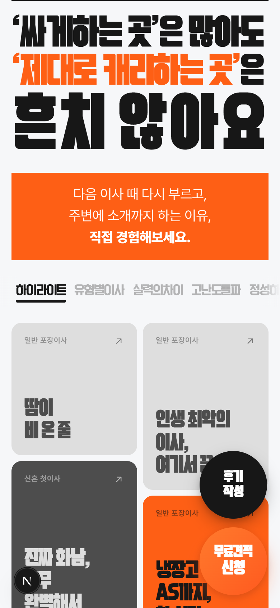
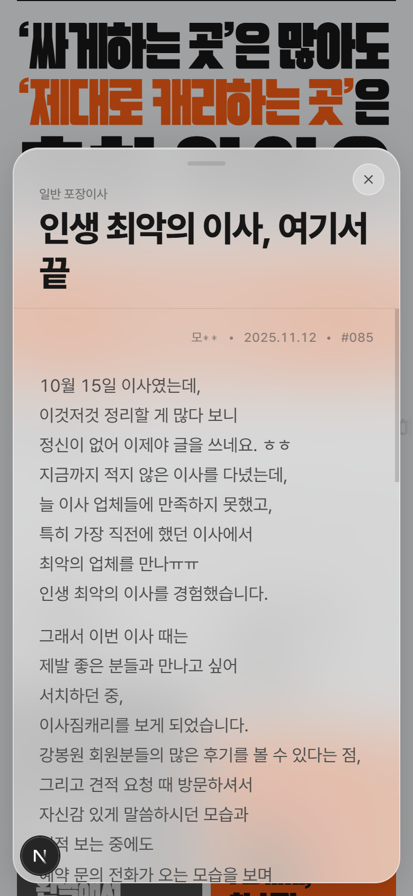
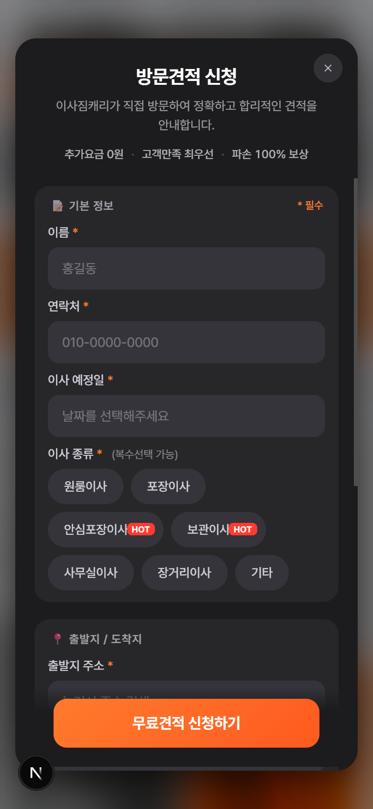

# 이사짐캐리 후기 페이지

이사짐캐리를 실제로 이용한 고객님들의 후기를 한눈에 모아 보는 페이지입니다.

  

## 바로 보기

**[확인 필요: 라이브 링크]**

## 이 페이지는

이사를 앞두고 업체를 고르는 분들을 위한 페이지입니다. 이사짐캐리를 이용한 고객님들이 직접 남긴 후기를 카테고리별로 모아 보여주고, 마음에 드는 후기를 눌러 전체 내용과 사진을 볼 수 있습니다. 여기서 바로 방문 견적도 신청할 수 있습니다.

## 주요 내용

- 실제 이용 고객이 직접 남긴 후기
- 후기 사진 첨부 지원
- "하이라이트", "가격", "재이사맛집" 등 상황별 카테고리로 후기 탐색
- 후기를 보다가 바로 방문 견적 신청
- 회원가입·앱 설치 없이 모바일 브라우저에서 바로 이용
- 이용 고객이라면 직접 후기 작성 가능

## 이용 흐름

| 단계 | 보이는 것 | 할 수 있는 것 |
|---|---|---|
| 후기 그리드 | 카테고리별 후기 카드 | 원하는 카테고리 탭 선택, 카드 넘겨보기 |
| 후기 상세 | 후기 전문, 첨부 사진 | 실제 이용 후기 자세히 읽기 |
| 방문 견적 신청 | 이사 정보 입력 폼 | 이름·연락처·이사 정보 입력 후 신청 |
| 접수 완료 | 접수 안내 | 담당자 연락 대기 |

  
  
  
  

주로 인스타그램 프로필 링크, 카카오톡 상담 답장, 명함 QR코드를 통해 접속합니다. 견적 신청은 1~2분이면 끝나며, 접수 후 담당자가 순차적으로 연락드립니다.

## 자주 묻는 질문

**서비스 지역이 어디인가요?**
[확인 필요]

**후기는 누구나 쓸 수 있나요?**
고객님이 직접 작성해 남기며, 운영자 확인 후 페이지에 게재됩니다.

**견적 신청하면 언제 연락이 오나요?**
[확인 필요]

**연락처가 어떻게 되나요?**
[확인 필요]

## Tech

Next.js · Supabase

기존에는 HTML 파일 한 장으로 운영하던 페이지였습니다. 2026년 8월, 고객이 직접 후기를 남기고 운영자가 검토 후 게재할 수 있도록 Next.js와 Supabase 기반으로 새로 만들었습니다.

## License / Contact

이사짐캐리 소유이며 무단 사용을 금합니다. 문의: [확인 필요]
